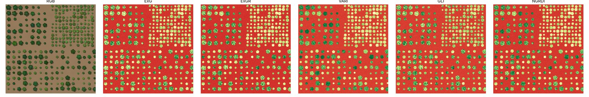
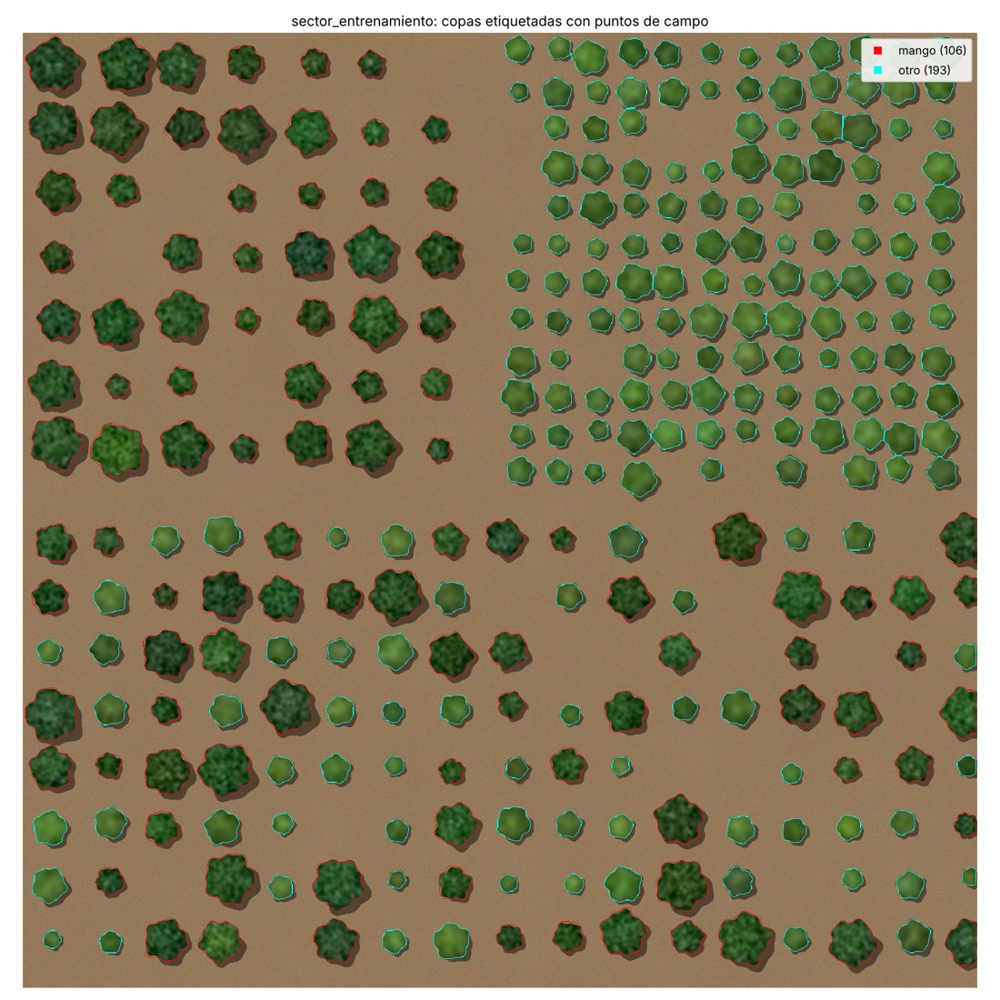
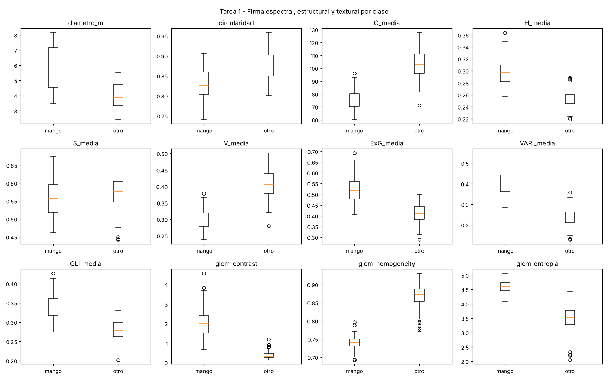
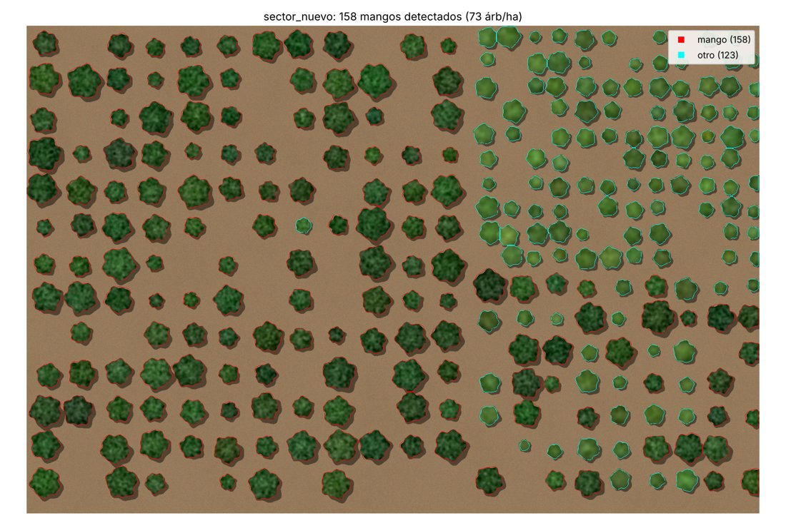
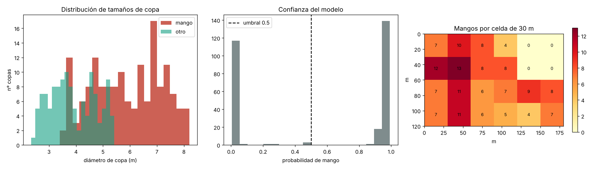

# Identificación y conteo de árboles de mango con imágenes de dron

Flujo reproducible en Python para tres tareas:

| Tarea | Qué hace | Script | Bibliografía |
|---|---|---|---|
| **1** | Analiza ortomosaicos de dron de un sector e **identifica el cultivo** (mango frente a otras copas) mediante índices de vegetación, segmentación de copas y su firma de forma, color y textura | `tarea1_identificar.py` | [BIBLIOGRAFIA.md § Tarea 1](BIBLIOGRAFIA.md#tarea-1-identificar-el-cultivo-mango-en-imágenes-de-dron) |
| **2** | **Entrena un modelo** de *machine learning* (Random Forest, SVM, Gradient Boosting) y, opcionalmente, un detector de *deep learning* (YOLO) | `tarea2_entrenar.py`, `yolo_mango.py` | [§ Tarea 2](BIBLIOGRAFIA.md#tarea-2-entrenar-el-modelo-machine-learning-y-deep-learning) |
| **3** | Con **imágenes nuevas** y el modelo entrenado, indica **si hay mangos, cuántos** y entrega **estadísticas** (densidad, cobertura, tamaño de copa, espaciamiento, IC 95 %, mapa por celdas) | `tarea3_contar.py`, `yolo_mango.py contar` | [§ Tarea 3](BIBLIOGRAFIA.md#tarea-3-detectar-y-contar-mangos-en-imágenes-nuevas-con-estadísticas) |

La bibliografía indexada (44 referencias con DOI, organizadas por tarea y enlazadas a cada paso del código) está en **[BIBLIOGRAFIA.md](BIBLIOGRAFIA.md)**.

---

## Instalación

```bash
cd drone-mango
pip install -r requirements.txt
# opcionales:
pip install rasterio      # GeoTIFF georreferenciados -> coordenadas reales y GeoJSON en su CRS
pip install ultralytics   # ruta deep learning (YOLO)
```

## Prueba rápida con datos sintéticos

Si todavía no tiene imágenes, `generar_demo.py` crea dos huertas **sintéticas** (GSD 10 cm) con
mangos y otros árboles, junto con su "verdad terreno":

```bash
python generar_demo.py --salida datos_demo
python tarea1_identificar.py datos_demo/sector_entrenamiento.png \
       --verdad datos_demo/sector_entrenamiento_verdad.csv --salida resultados/tarea1
python tarea2_entrenar.py resultados/tarea1/copas_caracteristicas.csv --salida resultados/tarea2
python tarea3_contar.py datos_demo/sector_nuevo.png --modelo resultados/tarea2/modelo_mango.joblib \
       --verdad datos_demo/sector_nuevo_verdad.csv --salida resultados/tarea3
```

> ⚠️ Los datos sintéticos sólo sirven para comprobar que el flujo funciona. Ahí las clases se
> separan casi perfectamente, así que **sus métricas no indican el desempeño en campo**. Con
> imágenes reales cabe esperar más confusión (sombras, copas solapadas, malezas, otros frutales
> de follaje oscuro como palto o cítricos).

---

## Uso con imágenes reales

### 0. Captura y preprocesamiento (recomendaciones)

* **Vuelo:** RGB de ≥ 20 MP, altura de 60–100 m (GSD ≈ 2–5 cm), traslape frontal y lateral de 75–80 %,
  cerca del mediodía o con cielo nublado para reducir sombras. Neupane et al. (2019) muestran que
  la detección cae de 96 % a 76 % al subir de 40 a 60 m, así que conviene probar la altura antes.
* **Ortomosaico:** generarlo con WebODM/OpenDroneMap, Pix4D o Agisoft Metashape y exportar un
  **GeoTIFF**. Si además se exporta el **DSM/CHM**, la altura de copa es un descriptor muy útil
  (Sarron et al. 2018; Torres-Sánchez et al. 2015).
* **Cámara solo RGB (modo por defecto):** todo el flujo funciona **sin NDVI ni banda infrarroja**.
  La vegetación se separa con el índice ExG y la clasificación usa índices RGB (ExG, ExGR, VARI,
  GLI, NGRDI), color y textura. Los resultados de la demo se obtuvieron así, solo con RGB.
* **Cámara multiespectral (opcional, a futuro):** si más adelante se cuenta con lente o filtro NIR,
  indique la banda con `--banda-nir N` y se agregará NDVI. No es necesario para identificar ni contar.
* **Ortomosaicos muy grandes:** use `--escala 0.5` (reduce la resolución) o recorte el área por sectores.

### 1. Tarea 1: identificar el cultivo

```bash
python tarea1_identificar.py sector_A.tif --verdad puntos_campo_A.csv --recortes --salida resultados/tarea1
```

* Calcula los índices RGB **ExG, ExGR, VARI, GLI, NGRDI** → `*_indices.png` (NDVI solo si se indica `--banda-nir`).
* Segmenta la vegetación (umbral de **Otsu** sobre ExG) y separa cada copa con **watershed**.
* Extrae unos 60 descriptores por copa: **forma** (área, diámetro, circularidad, solidez),
  **color** (RGB, HSV, CIELab), **índices** (media, DE, p90) y **textura** (GLCM de Haralick, LBP).
* **Etiquetado:**
  * *Con puntos GPS de campo* (`--verdad`): un CSV con columnas `x,y,clase` en el CRS del GeoTIFF
    (o `fila,col,clase` en píxeles). Cada copa recibe la clase del punto más cercano
    (emparejamiento húngaro, radio `--radio-emparejar`). Las copas sin punto se etiquetan como `otro`.
  * *Sin puntos de campo:* se genera `*_mapa_copas.png` con el id de cada copa y `--recortes`
    guarda un PNG por copa. Complete a mano la columna `clase` de `copas_caracteristicas.csv`
    (`mango` / `otro`).
* **Firma del cultivo:** `firma_por_clase.csv/png` compara mango frente a otras copas.

| Índices de vegetación | Copas etiquetadas (rojo = mango) | Firma por clase |
|---|---|---|
|  |  |  |

En la demo, el mango se distingue por copas más grandes (≈ 5,8 m frente a 4,0 m de diámetro),
más oscuras (V en HSV y G menores), con mayor VARI y textura más rugosa (mayor contraste GLCM y
mayor entropía).

### 2. Tarea 2: entrenar el modelo

```bash
python tarea2_entrenar.py resultados/tarea1/copas_caracteristicas.csv [otro_sector.csv ...] \
       --bloque-m 30 --salida resultados/tarea2
```

* Compara **Random Forest, SVM-RBF, Gradient Boosting y regresión logística**.
* Usa dos validaciones cruzadas: **k-fold estratificada** y **espacial por bloques**
  (`--bloque-m`), que evita inflar las métricas por autocorrelación espacial (Roberts et al. 2017;
  Ploton et al. 2020). Elige el mejor modelo por F1 en la validación espacial.
* Reporta exactitud, precisión, recall, F1, kappa y AUC (`comparacion_modelos.csv`), además de la
  matriz de confusión y la importancia de variables por permutación.
* Guarda el modelo en `modelo_mango.joblib`.

**Ruta deep learning (YOLO):** se recomienda cuando hay muchas copas etiquetadas o copas solapadas.

```bash
python yolo_mango.py exportar sector_A.tif --copas resultados/tarea1/copas_caracteristicas.csv \
       --etiquetas resultados/tarea1/sector_A_etiquetas.npy --salida dataset_yolo
python yolo_mango.py entrenar --datos dataset_yolo/data.yaml --modelo yolov8n.pt --epocas 100
```

Las cajas también pueden corregirse o dibujarse a mano en CVAT o Label Studio (formato YOLO).

### 3. Tarea 3: contar mangos en imágenes nuevas

```bash
python tarea3_contar.py sector_B.tif sector_C.tif --modelo resultados/tarea2/modelo_mango.joblib \
       [--verdad conteo_campo_B.csv conteo_campo_C.csv] --celda-m 30 --salida resultados/tarea3
# o con YOLO:
python yolo_mango.py contar sector_B.tif --pesos runs/detect/train/weights/best.pt
```

Por imagen se obtiene:

| Salida | Contenido |
|---|---|
| `resumen_conteo.json/.csv` | ¿hay mangos?, **nº de mangos**, nº de otras copas, % de mango, **conteo esperado e IC 95 %** (bootstrap), **densidad (árb/ha)**, cobertura de copa (%), área y diámetro de copa (media, DE, cuartiles), distancia al vecino más cercano, **índice de Clark-Evans** (patrón regular, aleatorio o agregado), nº de copas dudosas (probabilidad entre 0,3 y 0,7) y, si se da `--verdad`, **precisión, recall, F1 y error de conteo** |
| `*_copas_clasificadas.csv` | una fila por copa con su probabilidad de ser mango y sus descriptores |
| `*_copas.geojson` | puntos para QGIS/ArcGIS (en el CRS del GeoTIFF) |
| `*_conteo_por_celda.csv` | conteo y densidad por celda de grilla |
| `*_mapa_deteccion.png`, `*_estadisticas.png` | mapa de detecciones, distribución de tamaños, confianza y mapa de densidad |

| Detecciones (rojo = mango) | Estadísticas |
|---|---|
|  |  |

Resultado de la demo (sector nuevo, sintético, 2,16 ha): **158 mangos detectados frente a 159 reales**
(error de −0,6 %; precisión 1,00; recall 0,99), 73 árb/ha, copa de 5,9 ± 1,3 m, vecino más cercano a
8,5 m y Clark-Evans R = 1,45 (marco de plantación regular).

---

## Estructura

```
drone-mango/
├── BIBLIOGRAFIA.md          # referencias indexadas por tarea + matriz tarea↔código↔referencia
├── generar_demo.py          # huertas sintéticas para pruebas
├── tarea1_identificar.py    # tarea 1
├── tarea2_entrenar.py       # tarea 2 (ML clásico)
├── tarea3_contar.py         # tarea 3
├── yolo_mango.py            # tareas 2 y 3 con deep learning (YOLO)
├── mango_uav/
│   ├── imagen.py            # lectura de JPG/PNG/GeoTIFF, GSD, conversión píxel↔coordenadas
│   ├── indices.py           # ExG, ExGR, VARI, GLI, NGRDI, NDVI
│   ├── segmentacion.py      # máscara de vegetación + watershed de copas
│   ├── caracteristicas.py   # descriptores de forma, color, índices y textura por copa
│   └── utilidades.py        # etiquetado con GPS, evaluación, mapas, GeoJSON, recortes
└── docs/figuras/            # figuras de ejemplo (demo sintética)
```

## Limitaciones y recomendaciones

* La segmentación clásica funciona bien con copas **separadas**. Si las copas se solapan
  (huertas adultas o densas), conviene la ruta YOLO o agregar el CHM (altura) a la segmentación.
* Entrene y aplique el modelo con el **mismo GSD** (misma altura de vuelo y misma `--escala`). La
  textura y el tamaño en píxeles cambian con la resolución. En la demo, al aplicar a 20 cm un
  modelo entrenado a 10 cm, el conteo se mantuvo, pero la confianza bajó (conteo esperado de 139
  frente a 159 detectados).
* Entrene con imágenes de **varias fechas, sectores e iluminaciones**, y valide siempre en un
  sector **distinto** al de entrenamiento (la tarea 3 con `--verdad` hace justamente eso).
* Para **contar frutos** (no árboles) se necesitan vuelos bajos u oblicuos (GSD de 1 cm o menos) o
  imágenes desde tierra, y un detector de frutos (MangoYOLO, Koirala et al. 2019; Xiong et al. 2020).
  El mismo esquema de `yolo_mango.py` sirve si las cajas se etiquetan sobre los frutos.
